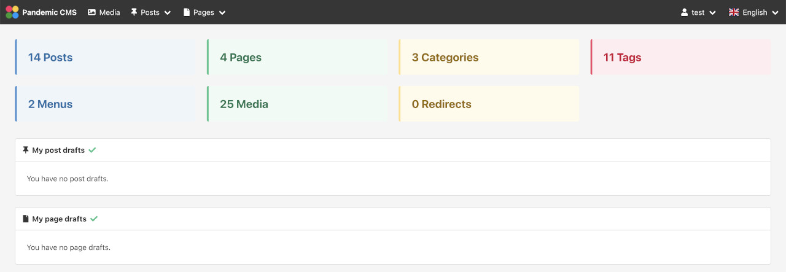

<h1>
  
  Pandemic CMS
</h1>

A CMS with all the necessary components to help you create fast and amazing websites. Why Pandemic CMS ? Because it was created during the pandemic. Here is the core philosophy of it:
- It provides core entities to help you get started fast, but it's designed to be easily extended with new entities. The core entities are the following:
  - Posts
  - Categories
  - Tags
  - Pages
  - Menus
  - Media
  - Settings
  - Email Templates
  - Users
  - Redirects
- The majority of web applications need a dashboard to keep track of users, edit settings and handle content. Pandemic CMS is designed to be easily extended and become that dashboard for your web applications, from simple blogs to big SaaS.
- Many applications need to support multiple languages. This is easy for static content, but what about dynamic content ? Pandemic CMS is designed to support multilingual content.
- Pandemic CMS is designed to be multi-tenant, meaning that it is possible to support multiple applications/clients on the same instance.

## Stack

**Programming languages**:

- Ruby
- JavaScript

**Web**:

- Ruby on Rails
- NodeJS
- Vite

**Jobs**:

- Solid Queue

**Testing**:

- RSpec
- Factory Bot

**Linting**:

- Rubocop
- ESLint

## Requirements

You need to have the following installed to run the project:

- Ruby (3.3.0)
- NodeJS (20.11.0)
- yarn
- libvips

## How to run the application

1. Run `bundle` to install the required gems.
1. Run `yarn` to install the node packages.
1. Run `EDITOR=<prefered editor (e.g. vim)> rails credentials:edit` to create a credentials file with a `secret_key_base` value.
1. Run `rails db:migrate` to prepare the database.
1. Run `./bin/dev`. This will run the rails server, the background job worker and will build the front-end assets. You can then visit the website in `http://localhost:3000`.

## Configuration

You can find all the classic rails configuration files under the `config` directory. Some of the most important configuration files are the following:
- **database.yml**: Contains configuration for the database. Currently, only SQLite and MySQL or MariaDB are supported.
- **search.yml**: Contains configuration for the search indexing functionality, which allows users to search for posts, etc. The configuration has mostly to do with the service backing the functionality. Currently, only database and elasticsearch are supported.
- **cache.yml**: Contains configuration for the service providing caching functionality to the application. Currently, only memory store and redis are supported.
- **smtp.yml**: Contains configuration for the service used to send emails. Currently, only file and smtp are supported. File stores emails in the `tmp/mails` directory and is meant only for development purposes.
- **super_admin.yml**: Contains configuration for the super admin pages (e.g. the credentials to enter). The included pages are the following:
  - **/jobs**: Contains information about the background jobs.
  - **/super_admin/clients**: Contains all the applications/clients running on the instance.

If you want to use MySQL, MariaDB, elasticsearch or redis, you have to install them or use `docker-compose.infrastructure.yml` with docker compose.

## Run the linters

- `bundle exec rubocop`
- `yarn lint`

## Run the tests

`bundle exec rspec`

## Docker compose

- `docker-compose.infrastructure.yml`: Spins up all infrastructure services (MariaDB, etc.).
- `docker-compose.yml`: Spins up all infrastructure services and the application. However, you must perform the following steps first:
  - Run `EDITOR=<prefered editor (e.g. vim)> rails credentials:edit -e production` to create a credentials file for production and add a `secret_key_base` value. You can run `rails secret` to generate a new secret value.
  - Add the content of `config/credentials/production.key` as value to `RAILS_MASTER_KEY` in `docker-compose.yml`.

## License

This project is licensed under the MIT License - see the [LICENSE](LICENSE) file for details.

## Contributors

&nbsp;

